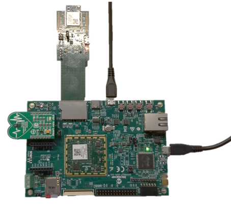
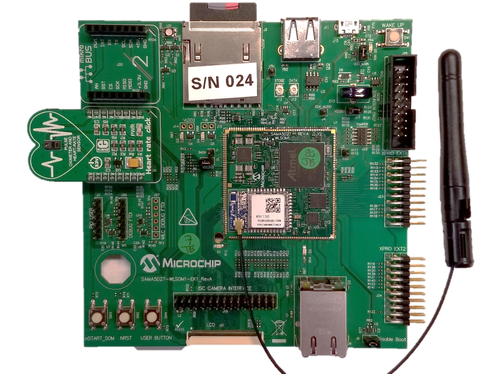
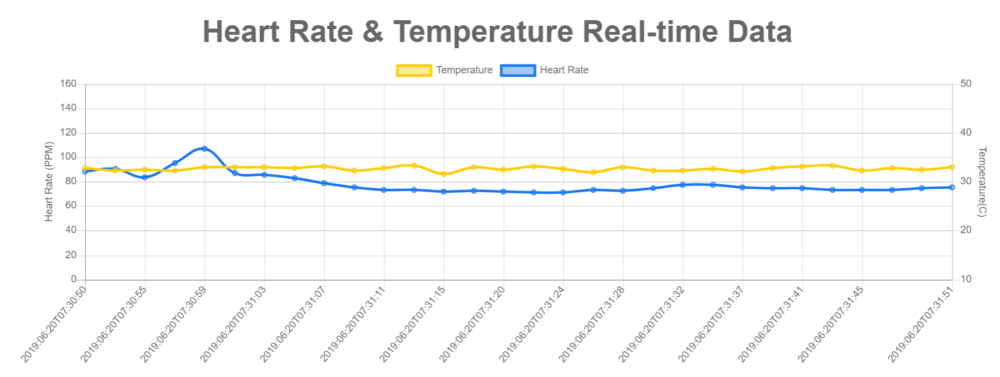
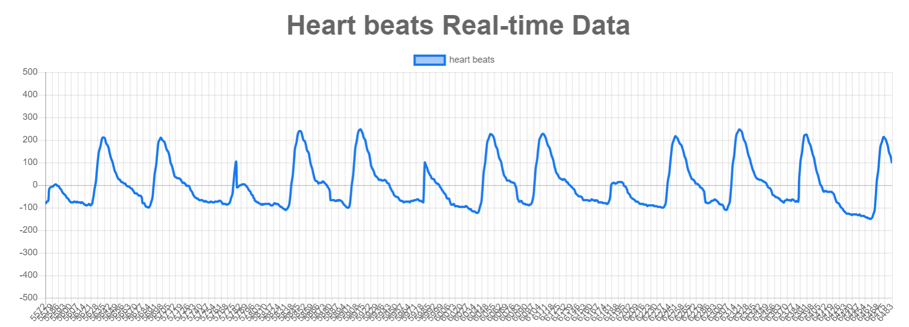

# Azure-IoT-Heart-rate-monitor
Monitor heart rate with Linux/python based code using Azure IoT hub and web apps.

# Setup options

**1. SAMA5D27-SOM1-EK:**

- SAMA5D2 SOM EK:
https://www.microchip.com/DevelopmentTools/ProductDetails/PartNO/ATSAMA5D27-SOM1-EK1
- WILC1000 or WILC3000:
https://www.microchip.com/developmenttools/ProductDetails/AC164158
- Mikroe-2000 heart rate click board:
https://www.mikroe.com/heart-rate-click

**2. SAMA5D27-WLSOM1-EK:**

- SAMA5D2 SOM EK:
- Mikroe-2000 heart rate click board:
https://www.mikroe.com/heart-rate-click

# Demo images

**For SAMA5D27-SOM1-EK:**
- SD card image based on python 2.7:
https://microchiptechnology-my.sharepoint.com/:u:/g/personal/amr_sayed_microchip_com/EdWcwHJN5LtLs46PX2JcC14BeDvpJ_0lPJGyeqve5EsJxg?download=1
- SD card image based on python 3.6:
https://microchiptechnology-my.sharepoint.com/:u:/g/personal/amr_sayed_microchip_com/EVdhOE3SZ7JGtXboZA2t1J8BAw0J9D9hu2ZUVzz7B4hM1w?download=1

**For SAMA5D27-WLSOM1-EK:**
- SD card image based on python 3.6:
https://microchiptechnology-my.sharepoint.com/:u:/g/personal/amr_sayed_microchip_com/EZ3m_19-bXNIlJgBcuhVaH8Bw3zFIO1dOErn56MOrKWr9Q?download=1

Flash the SD card image into a micro SD card using etcher:
https://www.balena.io/etcher/

username: root

# Connect to Wi-Fi

1. Make sure WILC SD is inserted.
2. The image will connect automatically to the following credentials:
**SSID**: MASTERS
**Passphrase**: microchip 
3. if the AP was not up at boot, or you wish to connect to another AP, use:
  * killall wpa_supplicant udhcpc
  * cd iot8
  * ./start_sta_pass_args.sh SSID Password
 
# Heart rate monitoring
1. Edit demo/SendDataToAzureCloud.py line 20 with your device connection string
2. Edit demo/SendDataToAzureCloud.py line 91 with your device ID
3. Edit Heart-rate-web-app/public/javascript/index.js line 136 with the device ID
4. Create an Azure Webapp with the repo at Heart-rate-web-app follow this (tutorial|https://docs.microsoft.com/en-us/azure/iot-hub/iot-hub-live-data-visualization-in-web-apps)

# Sample output

